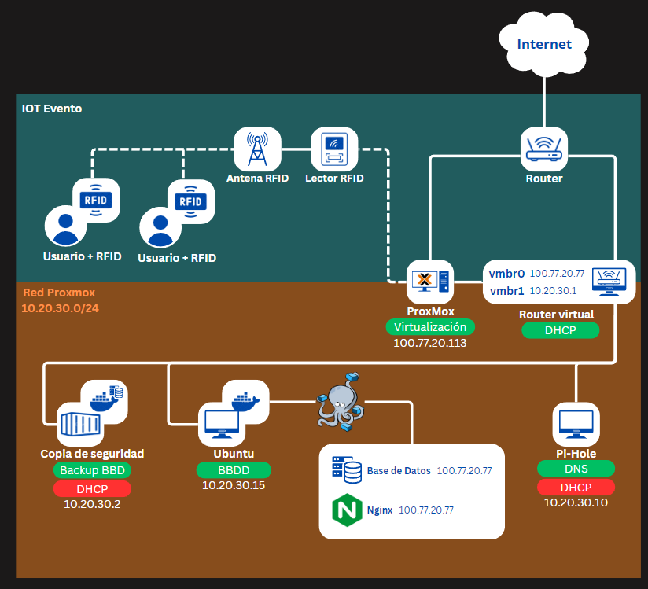

# RFID Traffic Analyst <br> Desarrolladores: Xavi Conde, Gerard Soteras
Sistema IoT con RFID que mide el interés de visitantes en ferias comerciales mediante el análisis del flujo y tiempo de permanencia en los stands, todo en tiempo real.
<hr>

## 💡  Explicación de la idea del proyecto
<details>
  <summary>Explicación 🔽</summary>
  
  En este proyecto exploraremos el mundo de los dispositivos IoT y la tecnología de transmisión por radiofrecuencia. Abordaremos temas como las ondas de radio y los distintos tipos de frecuencias existentes, en un ámbito innovador y en continuo desarrollo como el de los dispositivos IoT. Para ello, hemos optado por trabajar con la tecnología RFID, que combina los aspectos técnicos que buscamos analizar y desarrollar en este proyecto.
  
  El sistema funcionará de la siguiente manera: a los participantes se les proporcionarán etiquetas RFID pasivas, que serán detectadas por antenas RFID estratégicamente colocadas en el recinto. Estas antenas, conectadas a un lector RFID integrado en una Raspberry Pi, ampliarán el alcance de la señal según el tamaño del espacio. Los datos recopilados en tiempo real serán almacenados en una base de datos para su posterior análisis, generando informes que permitirán interpretar las preferencias del público y optimizar futuras estrategias.
  
  El objetivo principal es diseñar un sistema IoT para recopilar información en ferias comerciales, proporcionando a las empresas datos valiosos sobre el interés que generan entre los asistentes. Este sistema permitirá realizar un conteo preciso de las personas que se aproximan a cada puesto, así como medir el tiempo que permanecen en ellos. Además, la información recopilada se utilizará para obtener una visión general de los intereses del público, ayudando a las empresas a comprender mejor las preferencias de la población.

</details>

## 🎯  Objetivo que se persigue
<details>
  <summary>Explicación 🔽</summary>
  
  *Con todo esto hemos realizado la siguiente estructura, donde resume los objetivos que buscaremos cumplir.*

- **1 (Objetivo General)** - Diseñar y desarrollar una red de dispositivos IoT que utilice tecnología de transmisión por radiofrecuencia para recopilar y analizar datos en tiempo real.
- - **1.1 (Objetivo Específico)** - Programar dispositivos IoT capaces de interactuar mediante tecnología de radiofrecuencia.  
- - - **1.1.1 (Objetivo Operativo)** - Implementar placas Raspberry Pi con antenas RFID compatibles para gestionar la detección y transmisión de datos.  
- - - **1.1.2 (Objetivo Operativo)** - Configurar y trabajar con etiquetas RFID pasivas para la identificación precisa de participantes.  

- **2 (Objetivo General)** - Aplicar el sistema IoT en ferias comerciales y eventos para generar datos valiosos sobre el comportamiento del público y mejorar estrategias empresariales.  
- - **2.1 (Objetivo Específico)** - Optimizar la autonomía y capacidad del sistema para recopilar y analizar datos en entornos dinámicos. 
- - - **2.1.1 (Objetivo Operativo)** - Recopilar datos en tiempo real sobre el número de asistentes, ubicación y tiempo de permanencia en cada puesto.  
- - **2.2 (Objetivo Específico)** - Asegurar la integridad, confidencialidad y disponibilidad de los datos recopilados por el sistema.
- - - **2.2.1 (Objetivo Operativo)** - Implementar reglas de acceso y control en la base de datos para garantizar la seguridad de la información.
- - - **2.2.2 (Objetivo Operativo)** - Usar protocolos cifrados para la transmisión de datos y mantener copias de seguridad automáticas para prevenir pérdida de información.  


</details>

## 📝  Organización y roles del equipo
<details>
  <summary>Organización 🔽</summary>
  Al ser un grupo que en el primer año del grado ya trabajamos juntos en varios proyectos, la organización resultó sencilla.
  Hemos decidido que todos haremos de todo, pero cada uno tendrá un rol de “líder” en cada apartado en el que hemos distribuido el proyecto, este líder será el encargado únicamente de marcar el ritmo y de comunicar al resto del grupo cómo vamos en relación con los objetivos y fechas acordados al inicio.
  
  Al final de cada clase se pondrá en común el trabajo de cada integrante, con el objetivo de que todas las personas en todo momento sepan que se ha hecho ese día y si algún día hay una baja, que se pueda seguir trabajando con normalidad.
  En el aspecto de las tareas, todos haremos todas las tareas, sin excepción.
</details>

<details>
  <summary>Roles 🔽</summary>  
  
  - Xavi - Programación, Proxmox, gestores de tareas y escritos (GitHub)
  - Gerard - BBDD, Hardware, Redes, escritos (GitHub)
</details>

> [!IMPORTANT]
> Los líderes informan del tiempo, no quiere decir que trabajen más en esas áreas que otro compañero.

## 💻  Tecnologías a utilizar (lenguajes, framework, sistemas, software...)
<details>
  <summary>Programación 🔽</summary>

   - JavaScript
   - PHP
   - MySQL
   - Python
   - Arduino
</details>

<details>
  <summary>Base de Datos 🔽</summary>
  
  - MySQL database
</details>

<details>
  <summary>Cifrado 🔽</summary>
  
  En nuestro proyecto hemos elegido estas opciones de cifrado:
  - FALTA DECIDIR
</details>

<details>
  <summary>Certificados 🔽</summary>
  
  - OpenSSL -> TLS (de manera interna). 
  - Cloudflare SSL (de manera externa).
</details>

<details>
  <summary>Software 🔽</summary>
  
  - Visual Studio
  - Trello
  - GitHub
  - ChatGPT
</details>

<details>
  <summary>Hardware 🔽</summary>
  
  - Placa Aruino
  - Lector RFID
  - Tarjeta RFID
  - Cableado
</details>


## 🔨  Arquitectura del sistema
<details>
  <summary>Explicación 🔽</summary>
  
  Implementaremos una arquitectura basada en **tres capas**, diseñada para optimizar la recopilación, almacenamiento y análisis de datos provenientes de los dispositivos IoT con tecnología RFID. Esta estructura modular permite trabajar en cada capa de forma independiente, lo que facilita el desarrollo, la escalabilidad y el mantenimiento del sistema.
  
  Las tres capas se dividirán:
  - Capa de Dispositivos IoT (Cliente): Esta capa incluye las etiquetas RFID pasivas y las antenas RFID conectadas al Arduino. Los dispositivos detectan y transmiten los datos recopilados.
  - Capa de Procesamiento (Servidor): Encargada de recibir los datos desde los Arduinos, procesarlos, almacenarlos temporalmente y transferirlos a la base de datos central. Aquí se manejan las conexiones seguras y la lógica para garantizar la fiabilidad de los datos.
  - Capa de Almacenamiento y Análisis (BBDD): Se utiliza para almacenar de forma permanente los datos recopilados y procesados, permitiendo análisis posteriores. La base de datos será securizada para proteger la integridad y confidencialidad de la información.
</details>

<details>
  <summary>Tabla de arquitectura de los sistemas 🔽 ⚠️ </summary>
  
  | Máquina       | S.O                  | Almacenamiento / Memoria| Servicio     | 
  |---------------|----------------------|-------------------------|--------------|
  | **Proxmox**   |Proxmox-VE 8.2        | 93Gb / 8Gb              |  Hypervisor  |
  | **Router**    |Ubuntu server 22.04.2 | 14Gb / 4Gb              |  DHCP        |
  | **MySQL**     |Ubuntu server 22.04.2 | 14Gb / 4Gb              |Base de datos |
  | **Pi-Hole**   |Debian 12.7.0         | 14Gb / 512Mb            |      DNS     |
  | **Arduino**   |                      |                         | Lector RFID  |
  | **NGinx**     |Ubuntu server 22.04.2 | 14Gb / 4Gb              |    Hosting   |
</details>

<hr>

# Estilo de Marca
## 🖼️ Logotipo
<details>
  <summary>Explicación 🔽</summary>
  En este proyecto, hemos diseñado un logotipo que refleja los valores de innovación y dinamismo asociados a nuestra tecnología RFID. La forma principal está inspirada en una onda, un elemento que simboliza tanto la conectividad como el flujo constante de información, pilares fundamentales de nuestra actividad. La onda se presenta atravesando un objeto, lo que transmite una sensación de movimiento y energía, reforzando la idea de una tecnología que nunca se detiene y que conecta de manera fluida diferentes elementos.
  
  Los colores principales seleccionados para el logotipo son:
  - Azul (#136AD3): Representa la confianza, la estabilidad y el carácter tecnológico de nuestra marca. Es un color asociado tradicionalmente con la innovación y la precisión técnica.
  - Naranja (#F26419): Un tono vibrante que aporta energía, creatividad y entusiasmo, equilibrando la seriedad del azul con un toque más humano y cercano.
  
  Como color auxiliar, se utiliza el negro (#000000), que añade contraste, elegancia y versatilidad al diseño, permitiendo que el logotipo funcione eficazmente en una variedad de aplicaciones y contextos.
</details>

<details>
  <summary>Paleta de color 🔽</summary>
  

</details>
  
<details>
  <summary>Imagen del logotipo 🔽</summary>


</details>

<hr>

# 󠁧󠁢󠁷🐋 Docker (introducción)
Docker ofrece un método unificado para ejecutar su código. Actúa como un sistema operativo diseñado específicamente para contenedores. Así como una máquina virtual abstrae el hardware del servidor, los contenedores en Docker abstraen y virtualizan el sistema operativo del servidor, simplificando su gestión.

<details>
  <summary>Preguntas Docker 🔽</summary>

<details>
  <summary>¿Qué son los contenedores de Docker? 🔽</summary>
  Los contenedores de Docker son entornos ligeros y portátiles que permiten ejecutar aplicaciones de manera aislada junto con todas sus dependencias. Funcionan como una especie de "máquina virtual", pero sin la sobrecarga de un sistema operativo completo, ya que comparten el kernel del sistema anfitrión.
</details>
  
<details>
  <summary>¿Qué diferencias hay entre los contenedores de Docker y los LXC? 🔽</summary>
  Los contenedores de Docker y LXC (Linux Containers) difieren principalmente en su enfoque y nivel de abstracción. Docker está diseñado para empaquetar y ejecutar aplicaciones junto con sus dependencias, proporcionando un entorno estandarizado y fácil de gestionar mediante herramientas como docker-compose. En cambio, LXC ofrece una virtualización más ligera de sistemas completos, permitiendo mayor flexibilidad y personalización, aunque requiere más configuración manual. Mientras que Docker se basa en imágenes preconfiguradas y ofrece un mayor aislamiento mediante namespaces y cgroups, LXC se asemeja más a un sistema host, brindando menos aislamiento. En resumen, Docker es ideal para la portabilidad y despliegue de aplicaciones, mientras que LXC es más adecuado para entornos que requieren una estructura similar a una máquina virtual.
</details>

<details>
  <summary>¿Cuál es la diferencia entre una imagen y un contenedor en Docker? 🔽</summary>

  - **Imagen**: Es un conjunto inmutable de capas que contiene el sistema base y las aplicaciones necesarias para ejecutarse. Es como una plantilla.
  - **Contenedor**: Es una instancia en ejecución de una imagen. Puede tener cambios en tiempo de ejecución, pero estos no afectan la imagen base.

    Ejemplo:
    - `nginx:latest` es una **imagen**.
    - Un servidor en ejecución basado en `nginx:latest` es un **contenedor**.
  
</details>

<details>
  <summary>¿Qué sucede con los datos cuando un contenedor se elimina? 🔽</summary>
  Cuando un contenedor de Docker se elimina, por defecto todos los datos almacenados dentro de él desaparecen, ya que los contenedores están diseñados para ser efímeros. Sin embargo, se puede preservar la información ya sea configurando un volumen o un bind mount.
</details>


<details>
  <summary>¿Cuáles son las ventajas de utilizar contenedores de docker? 🔽</summary>

<details>
  <summary>1️⃣ Portabilidad 🔽</summary>
  
  - Funciona igual en cualquier máquina que tenga Docker instalado, sin importar el sistema operativo.
  - Se pueden compartir imágenes de Docker
</details>
<details>
  <summary>2️⃣ Ligereza y eficiencia 🔽</summary>
  
  - A diferencia de las máquinas virtuales, los contenedores tienen menos consumo de recursos.
  - A diferencia de las máquinas virtuales, los contenedores Docker se pueden iniciar de forma rápida y sencilla
</details>
<details>
  <summary>3️⃣ Facilidad de despliegue y gestión 🔽</summary>
  
  - Gracias a Docker Compose, se puede definir y ejecutar múltiples contenedores con un solo archivo. 
</details>
<details>
  <summary>4️⃣ Escalabilidad y modularidad 🔽</summary>
  
  - Con Docker se puede dividir aplicaciones en múltiples servicios independientes, facilitando el escalado y mantenimiento.
  - Se puede desplegar múltiples instancias de una aplicación y balancear la carga de manera sencilla. 
</details>
<details>
  <summary>5️⃣ Seguridad y aislamiento 🔽</summary>
  
  - Al trabajar con contenedores independientes, si surgiera algún imprevisto en un contenedor, el resto de ellos no se verían afectados al igual que el sistema host.
  - Se pueden definir permisos y redes personalizadas para cada contenedor y así limitar el acceso a ellos.
</details>
</details>

<details>
  <summary>¿Qué tipo de aplicaciones y servicios se pueden desplegar con docker? 🔽</summary>
  
  Docker permite desplegar una amplia variedad de aplicaciones y servicios en contenedores, incluyendo: 
  - Servidores web como Nginx o Apache
  - Aplicaciones backend con Node.js, Django
  - Bases de datos como MySQL, PostgreSQL o MongoDB
  - Servicios de mensajería como Redis.
  
  También facilita la ejecución de microservicios, entornos de desarrollo aislados y aplicaciones basadas en inteligencia artificial con herramientas como TensorFlow.
</details>

<details>
  <summary>¿Qué otros tipos de contenedores existen además de docker? 🔽</summary>
  
  Además de Docker, existen otros tipos de contenedores y tecnologías de contenedorización como:
  - Podman: Similar a Docker, pero sin necesidad de un demonio en segundo plano y con una arquitectura más segura basada en rootless containers.
  - LXC (Linux Containers): Un enfoque más ligero que Docker, proporcionando entornos de sistema operativo completos sin el overhead de una máquina virtual.
  - Kubernetes Containers: Aunque Kubernetes no es un motor de contenedores en sí, usa contenedores como Docker o containerd para orquestar y gestionar aplicaciones a gran escala.
  - containerd: Un runtime ligero para la gestión de contenedores que forma la base de Docker y Kubernetes.
  - CRI-O: Un runtime diseñado específicamente para Kubernetes, optimizado para la ejecución eficiente de contenedores en clústeres.
  - Singularity: Enfocado en entornos de alto rendimiento y computación científica, permitiendo ejecutar contenedores sin necesidad de privilegios de root.
</details>
</details>

> 🛠️ [**Ver la implementación de Docker en el proyecto.**](#-docker)

<hr>

# 🚀 PROXMOX
Proxmox Virtual Environment (Proxmox VE) es un entorno de virtualización de servidores de código abierto. Es una distribución de GNU/Linux basada en Debian, con una versión modificada del Kernel Ubuntu LTS​ y permite desplegar y gestionar máquinas virtuales y contenedores LXC.

Para la creación de nuestro proyecto, vamos a usar Proxmox. Utilizaremos uno de los ordenadores disponibles en el aula para montar nuestro servidor PROXMOX, con el que trabajaremos para crear todos los servicios que necesitamos.

## 🟠  Entorno ProxMox
<details>
  <summary>Explicación 🔽</summary>
  Dentro de Proxmox, configuraremos una red NAT para que todas las máquinas virtuales tengan conectividad interna.
  
  El sistema contará con cuatro servidores Ubuntu con funciones específicas:
  - Router virtual (DHCP): Gestionará el tráfico de red y asignará direcciones IP mediante DHCP.
  - Servidor Pi-Hole (DNS): Actuará como servidor DNS para todos los dispositivos dentro de la red, mejorando la gestión de nombres y bloqueando contenido no deseado.
  - Servidor de contenedores (Docker): Alojará nuestra base de datos y un servicio NGINX, que en el futuro permitirá el manejo individualizado de datos para cada empresa en las ferias.
  - Servidor de backups (Contenedor): Almacenará copias de seguridad de la base de datos para garantizar la integridad y disponibilidad de la información.
  
  Para crear la red NAT con la que se comunicarán las máquinas dentro de Proxmox, añadiremos un "Linux Bridge" y lo configuraremos para crear la red interna, a la que llamaremos vmbr1. Por defecto, la red externa (en nuestro caso la del aula) se llama vmbr0.
  El proceso que seguimos fue el siguiente: primero, instalamos y configuramos la máquina router. Al añadir la máquina, le asignamos la nueva interfaz de red que creamos anteriormente en el apartado de hardware. Una vez configurado el router, duplicamos la máquina para crear el equipo cliente, y modificamos el netplan para que tenga su propia dirección IP dentro de la red interna. 
  
  ### Configuración de QEMU
  Instalaremos en el router el paquete qemu-guest-agent. Gracias a esto, podremos administrar las máquinas virtuales de una manera más fácil.
  Una vez instalado en las máquinas, es necesario configurar las máquinas virtuales que nos ofrece Proxmox.
</details>

> 📎 [**Ver _anexo 1_ para entorno ProxMox**](#anexo-1-entorno-proxmox)

## 🕸️  Arquitectura de Red
<details>
  <summary>Explicación 🔽</summary>
  
  El sistema estará dividido en dos redes principales:
  - IOT Evento: Donde se encuentran las etiquetas RFID que llevarán los asistentes en el evento. Estas etiquetas se comunican con los lectores RFID a través de una antena. Los lectores capturan los datos y los envían a nuestro servidor en el evento, que ejecuta Proxmox.
  - Red Proxmox: Red interna donde estarán los servicios esenciales del sistema.
  
  Dentro del entorno virtualizado en Proxmox, tendremos varios servidores con funciones específicas:
  - Router Virtual (DHCP): Conecta ambas redes y asigna direcciones IP dentro de la Red Proxmox.
  - Servidor Pi-Hole (DNS): Actúa como servidor DNS para todos los dispositivos dentro de la red, facilitando la gestión de nombres de dominio.
  - Servidor de contenedores (Docker): Alojará nuestra base de datos MySQL y un servicio Nginx, que permitirá a las empresas de los stands acceder a una página privada con los datos recopilados por su antena RFID.
  - Servidor de backups (Contenedor): Se encargará de realizar copias de seguridad de la base de datos para garantizar la integridad y disponibilidad de la información.

  Para crear la red NAT con la que se comunicarán las máquinas dentro de Proxmox, añadiremos un Linux Bridge (vmbr1) para la red interna, manteniendo vmbr0 como la conexión externa del evento.
</details>

<details>
  <summary>Imagen de arquitectura de red final 🔽</summary>
  
  
</details>

<details>
  <summary>Tabla de arquitectura de red final 🔽</summary>
  
  | Máquinas         | IP                                         | IP Gateway                          | Red                           |
  |------------------|--------------------------------------------|-------------------------------------|-------------------------------|
  | Proxmox          | 100.77.20.113                              | 100.77.20.1                         | 100.77.20.0/24                |
  | Router           | 100.77.20.77 (externa)<br>10.20.30.1 (interna) | 100.77.20.1 (externa)<br>10.20.30.1 (interna) | vmbr0 (100.77.20.0/24)<br>vmbr1 (10.20.30.0/24) |
  | Pihole           | 10.20.30.10                                | 10.20.30.1                          | vmbr1 (10.20.30.0/24)         |
  | Docker           | 10.20.30.15                                | 10.20.30.1                          | vmbr1 (10.20.30.0/24)         |
  | Docker > Portainer | 10.20.30.15:9443                         | 10.20.30.1                          | vmbr1 (10.20.30.0/24)         |
  | Docker > MySQL   | 10.20.30.15:xxxx                           | 10.20.30.1                          | vmbr1 (10.20.30.0/24)         |
  | Docker > PHPMyAdmin | 10.20.30.15:xxxx                        | 10.20.30.1                          | vmbr1 (10.20.30.0/24)         |
  | Docker > Nginx   | 10.20.30.15:88                             | 10.20.30.1                          | vmbr1 (10.20.30.0/24)         |
  | Contenedor BKP   | 10.20.30.16                                | 10.20.30.1                          | vmbr1 (10.20.30.0/24)         |


</details>

> [!IMPORTANT]
> Las funciones del cliente y Nginx se verán modificadas por la futura integración de Cloudflare en el proyecto. Más adelante veremos como afecta.

## 🛠️  Configuración de ROUTER
<details>
  <summary>Explicación 🔽</summary>
  Primero configuramos la red del router. Para ello cambiaremos el netplan ajustando las IP según la red, virtual o aula. Con ens18 identificaremos la red del aula y con ens19 la red virtual.
  Además, hemos implementado el servicio de DHCP en el router para que todos los dispositivos que estén dentro de la red virtual puedan obtener una IP sin necesidad de asignarla manualmente.
  
  ### Configuración de DHCP
  Para configurar el servicio DHCP, primero lo instalaremos en el router con el comando correspondiente. Luego crearemos una copia de seguridad del archivo de configuración para conservar la configuración original. Procederemos a editar el archivo de configuración y, en nuestro caso, hemos asignado el rango de IPs de *10.20.30.20* a *10.20.30.50*.
  
  También configuraremos distintas IPs para que siempre se asignen a las máquinas con los servicios de nuestra red de Proxmox, haciendo uso de su MAC. Gracias a esto conseguimos que siempre que se inicien las máquinas, tengan la misma dirección IP. Además, modificaremos el archivo ```isc-dhcp-server``` para indicar al router que funcione como servidor DHCP en la interfaz ens19.

```
# comandos usados

sudo apt install isc-dhcp-server                        # instalación del servicio DHCP
sudo cp /etc/dhcp/dhcpd.conf /etc/dhcp/dhcpd.conf.BKP   # creación de la copia de archivo
sudo nano /etc/dhcp/dhcpd.conf                          # modificación del archivo de configuración
sudo nano /etc/default/isc-dhcp-server                  # modificación del archivo de asiganción de interfaz
```

  ### Configuración de IPTables ⚠️
</details>

> 📎 [**Ver _anexo 2_ para configuración del Router**](#anexo-2-configuración-del-router)
>
> 🚩 [Ver informe de errores](#errores-con-el-router)


## 󠁧󠁢󠁷🐋 Docker
<details>
  <summary>Explicación 🔽</summary>
  
  En nuestro proyecto, utilizaremos Docker para optimizar recursos y simplificar la gestión de nuestras aplicaciones.
  Docker nos permitirá desplegar contenedores ligeros, asegurando que cada servicio se ejecute de manera aislada y eficiente. Esto facilitará el desarrollo, la escalabilidad y el mantenimiento del sistema, ya que cada componente (base de datos, servidor web, herramientas de gestión, etc.) estará empaquetado en su propio contenedor con todas sus dependencias.
</details>

<details>
  <summary>🛠️  Configuración Docker 🔽</summary>

Para desplegar nuestros contenedores, primero creamos una máquina virtual en Proxmox, a la cual le asignamos la IP fija `10.20.30.15` dentro de nuestra red interna.

Una vez creada la VM, procedimos a instalar Docker. Como solo usamos un usuario llamado "docker", añadiremos dicho usuario al grupo de Docker y le damos todos los permisos para que pueda crear y administrar los contenedores. 

Para facilitar la administración visual de los contenedores, instalamos Portainer como un contenedor en Docker.

Para gestionar los contenedores, accedemos a Portainer desde una máquina virtual con Debian Desktop, ingresando en el navegador la Ip del equipo seguido del puerto que configuramos para portainer. `10.20.30.15:9443`
Aquí podemos visualizar y administrar nuestros contenedores de forma intuitiva, facilitando la gestión de servicios como la base de datos, Nginx y otros.

```bash
# comandos usados

###
instalación docker

sudo apt update && sudo apt upgrade -y # actualizar paquetes
sudo apt install -y apt-transport-https ca-certificates curl software-properties-common # instalar dependencias necesarias
curl -fsSL https://download.docker.com/linux/ubuntu/gpg | sudo gpg --dearmor -o /usr/share/keyrings/docker-archive-keyring.gpg # agregar la clave GPG de Docker
echo "deb [arch=$(dpkg --print-architecture) signed-by=/usr/share/keyrings/docker-archive-keyring.gpg] https://download.docker.com/linux/ubuntu $(lsb_release -cs) stable" | sudo tee /etc/apt/sources.list.d/docker.list > /dev/null # agregar el repositorio oficial de Docker
sudo apt update
sudo apt install -y docker-ce docker-ce-cli containerd.io # instalar docker
docker --version # verificar si docker está correctamente instalado

###

sudo usermod -aG docker $USER  # Agregar usuario al grupo Docker (requiere reiniciar sesión)

docker run -d -p 8000:8000 -p 9443:9443 --name portainer --restart=always -v /var/run/docker.sock:/var/run/docker.sock -v portainer_data:/data portainer/portainer-ce:latest  # creación de contenedor portainer 
```
</details>

<details>
  <summary>🛠️  Configuración Docker-Compose 🔽</summary>

  Para agilizar el despliegue de los contenedores que contendrán nuestra página web y base de datos, utilizamos Docker-Compose. Con esta herramienta, podemos definir y gestionar múltiples servicios en un solo archivo de configuración `(docker-compose.yml)`, lo que facilita la implementación y administración del entorno.

  [📑 Archivo de configuración docker-compose](assets/docker-compose.yml)

  📑 **Servicios incluidos**
  | Servicio     | Función                                        |
  |--------------|------------------------------------------------|
  | **PHP-FPM**  | Procesamiento de archivos PHP                  |
  | **MySQL**    | Base de datos para almacenamiento de información |
  | **phpMyAdmin** | Interfaz web para gestionar MySQL            |
  | **Nginx**    | Servidor web que maneja las peticiones HTTP    |

  Con esta configuración, conseguimos un entorno completo con PHP, MySQL, phpMyAdmin y Nginx, todos conectados en una red interna de Docker (app-network), lo que facilita la gestión y escalabilidad de nuestra aplicación.

  ```bash
# comandos usados

sudo apt install -y docker-compose  # instalar docker-compose
docker-compose up -d  # crear los contenedores en segundo plano
docker ps  # verificar que los contenedores están corriendo 
  ```
  
</details>

> 📎 [**Ver _anexo 3_ para configuración de Docker**](#anexo-3-configuración-de-docker)
>
> 🚩 [Ver informe de errores](#errores-con-docker) ⚠️
<hr>

# 📎 Anexos
En este apartado se encuentran los detalles más específicos de configuración del proyecto.

## Anexo 1 (entorno ProxMox)
<details>
  <summary>Ver anexo 🔽</summary>
  
  ### Adaptador puente
  Asignamos al router que use un adaptador puente para que pueda comunicar el interior de la red, con el exterior. Esto lo hacemos configurando el vmbr0 con la red externa y añadiendo un nuevo adaptador vmbr1 con la IP de la red virtual.
  
  
  ### Interfaz de red para el router
  Aquí podemos ver que una vez realizadas las acciones de la imagen anterior, el router ya nos reconocerá como hardware, las dos interfaces de red.
  
  
  ### Panel de configuración para activar QEMU
  Activamos y configuramos la función QEMU, para que nos sea mucho más fácil trabajar con las IP's existentes sin necesidad de acceder a la máquina.
  
  
  ### Configuración IPtables
</details>

## Anexo 2 (configuración del Router)
<details>
  <summary>Ver anexo 🔽</summary>
  
  ### Netplan del router
  Esta configuración es extremadamente importante para que el router garantice la total comunicación entre la red interna y la externa, en la primera parte vemos la configuración para la red 100.77.20.0/24 (externa) y en la segunda parte 10.20.30.0/24 (virtual).
  
  
  ### Archivo sysctl
  Configuramos el router para que pueda hacer de gateway y pueda enrutar el tráfico de red para garantizar la comunicación en las redes presentes en el archivo "netplan".
  
  
  ### Archivo de configuración DHCP en el router
  Añadimos y modificamos las lineas necesarias en para que el router haga de DHCP en la red 10.20.30.0/24. Para garantizar la seguridad y la redundancia de IP's dentro de esta red, además configuramos una línea para que empiece a asignar IP's a partir de la 10.20.30.20, para poder añadir contenedores, equipos y servidores sin que afecten a la asignacion de IP's. También especificamos que el servidor DNS se encuentra en la dirección IP 10.20.30.10.
  
  

  También añadiremos unas líneas para que siempre se asigne la misma IP a unos equipos determinados. Esto lo logramos asociando una IP a una MAC.

  
  ### Archivo de configuración ISC-DHCP en el router
  Con estas líneas le pedimos al router que asigne direcciones IP solo en la interfaz ens19 para IPv4, usando las rutas de configuración y PID predeterminadas. No está configurado para IPv6.

  
</details>

## Anexo 3 (configuración de Docker)
<details>
  <summary>Ver anexo 🔽</summary>
  
  ### Organización de directorios en Docker
  Para mantener nuestro proyecto ordenado y estructurado, hemos organizado los archivos y directorios de la siguiente manera. Gracias a esta estructura, docker-compose pude ejecutarse de forma correcta.

  

  ### Archivo de configuración Nginx
  Para que nuestro servidor Nginx sirva correctamente nuestra aplicación, hemos modificado el archivo de configuración por defecto. En la imagen a continuación, se muestra el contenido del archivo `default.conf`, donde hemos ajustado la configuración para que apunte a nuestro archivo index.php y procese correctamente las peticiones a través de PHP-FPM.

  
  
</details>

<hr>

# 🚩 Informe de errores
En este apartado se encuantran todas las dificultades y errores que han ido surgiendo a medida que progresava el proyecto.

## Errores con el router
<details>
  <summary>Ver informe 🔽</summary>
A la hora de configurar el router, tuvimos sobre todo problemas con errores tipográficos. Esto sucedió tanto en la configuración de Netplan como en la configuración de las reglas de IPtables.
Además, tuvimos varios problemas al intentar guardar las reglas de IPtables, ya que, al reiniciar el router, algunas reglas desaparecían. Esto ocurría porque las reglas no se guardaban de modo persistente.
</details>
  
## Errores Pi-hole DNS Server
<details>
  <summary>Ver informe 🔽</summary>
  
  En la version de **Proxmox 8.2 y 8.3**, el archivo ```/etc/resolv.conf``` se sobrescribe automáticamente dos veces al reiniciar la máquina debido a:

  **1a vez:** *Servicio systemd-resolved:* Modifica el archivo de configuración DNS, de manera automática.

  **2a vez:** *Proxmox:* Sobrescribe el archivo durante el inicio del contenedor.

  Esto provoca que:
    **No** podemos modificar manualmente el archivo /etc/resolv.conf.
    **No** se pueden ejecutar scripts que cambien el archivo en el arranque del contenedor.
    **No** se puede filtrar el tráfico DNS adecuadamente.
    El DNS **siempre** se establece en 8.8.8.8, ignorando configuraciones internas.
    Entre muchas otras conseqüencias...
    
  ✅**SOLUCIÓN**
  **Paso 1:** *Detener el servicio systemd-resolved*
  Detenemos el servicio para evitar que sobrescriba el archivo DNS.
  
```
systemctl disable systemd-resolved
systemctl stop systemd-resolved
```

  **Paso 2:** *Configurar DNS en cada arranque. utilizando ```crontab```*

  Modificar el archivo crontab, ya que este archivo ejecuta instrucciones de manera persistente.

```
#Localizacion del archivo /tmp/crontab.RwAtVi/crontab
crontab -e
@reboot echo "nameserver 127.0.0.1" > /etc/resolv.conf #Añadir esta linea, dentro del archivo
```

  Esta línea asegura que el archivo ```/etc/resolv.conf``` apunte al servidor DNS local (127.0.0.1) en cada reinicio, evitando sobrescrituras por parte de Proxmox o systemd-resolved.
  Con estos pasos, se asegura que el contenedor de Pi-hole utilice su propio servidor DNS de manera persistente, permitiendo un filtrado efectivo del tráfico DNS y manteniendo la configuración deseada entre reinicios.
</details>

