# RFID Traffic Analyst <br> Desarrolladores: Xavi Conde, Gerard Soteras
Sistema IoT con RFID que mide el interés de visitantes en ferias comerciales mediante el análisis del flujo y tiempo de permanencia en los stands, todo en tiempo real.
<hr>

## 💡  Explicación de la idea del proyecto
<details>
  <summary>Explicación 🔽</summary>
  
  En este proyecto exploraremos el mundo de los dispositivos IoT y la tecnología de transmisión por radiofrecuencia. Abordaremos temas como las ondas de radio y los distintos tipos de frecuencias existentes, en un ámbito innovador y en continuo desarrollo como el de los dispositivos IoT. Para ello, hemos optado por trabajar con la tecnología RFID, que combina los aspectos técnicos que buscamos analizar y desarrollar en este proyecto.
  
  El sistema funcionará de la siguiente manera: a los participantes se les proporcionarán etiquetas RFID pasivas, que serán detectadas por antenas RFID estratégicamente colocadas en el recinto. Estas antenas, conectadas a un lector RFID de Arduino, ampliarán el alcance de la señal según el tamaño del espacio. Los datos recopilados en tiempo real serán almacenados en una base de datos para su posterior análisis, generando informes que permitirán interpretar las preferencias del público y optimizar futuras estrategias.

  El objetivo principal es diseñar un sistema IoT para recopilar información en ferias comerciales, proporcionando a las empresas datos valiosos sobre el interés que generan entre los asistentes. Este sistema permitirá realizar un conteo preciso de las personas que se aproximan a cada puesto, así como medir el tiempo que permanecen en ellos. Además, la información recopilada se utilizará para obtener una visión general de los intereses del público, ayudando a las empresas a comprender mejor las preferencias de la población.

</details>

## 🎯  Objetivo que se persigue
<details>
  <summary>Explicación 🔽</summary>
  
  *Con todo esto hemos realizado la siguiente estructura, donde resume los objetivos que buscaremos cumplir.*

- **1 (Objetivo General)** - Diseñar y desarrollar una red de dispositivos IoT que utilice tecnología de transmisión por radiofrecuencia para recopilar y analizar datos en tiempo real.
- - **1.1 (Objetivo Específico)** - Programar dispositivos IoT capaces de interactuar mediante tecnología de radiofrecuencia.  
- - - **1.1.1 (Objetivo Operativo)** - Implementar placas Raspberry Pi con antenas RFID compatibles para gestionar la detección y transmisión de datos.  
- - - **1.1.2 (Objetivo Operativo)** - Configurar y trabajar con etiquetas RFID pasivas para la identificación precisa de participantes.  

- **2 (Objetivo General)** - Aplicar el sistema IoT en ferias comerciales y eventos para generar datos valiosos sobre el comportamiento del público y mejorar estrategias empresariales.  
- - **2.1 (Objetivo Específico)** - Optimizar la autonomía y capacidad del sistema para recopilar y analizar datos en entornos dinámicos. 
- - - **2.1.1 (Objetivo Operativo)** - Recopilar datos en tiempo real sobre el número de asistentes, ubicación y tiempo de permanencia en cada puesto.  
- - **2.2 (Objetivo Específico)** - Asegurar la integridad, confidencialidad y disponibilidad de los datos recopilados por el sistema.
- - - **2.2.1 (Objetivo Operativo)** - Implementar reglas de acceso y control en la base de datos para garantizar la seguridad de la información.
- - - **2.2.2 (Objetivo Operativo)** - Usar protocolos cifrados para la transmisión de datos y mantener copias de seguridad automáticas para prevenir pérdida de información.

- **3 (Objetivo General)** - Aumentar nuestros conocimientos
- - **3.1 (Objetivo Específico)** - Alcanzar ámbitos y conceptos nuevos.  
- - - **3.1.1 (Objetivo Operativo)** - Hacer un trabajo personal extraescolar, para abastecernos de nueva teoría.  

</details>

## 📝  Organización y roles del equipo
<details>
  <summary>Organización 🔽</summary>
  Al ser un grupo que en el primer año del grado ya trabajamos juntos en varios proyectos, la organización resultó sencilla.
  Hemos decidido que todos haremos de todo, pero cada uno tendrá un rol de “líder” en cada apartado en el que hemos distribuido el proyecto, este líder será el encargado únicamente de marcar el ritmo y de comunicar al resto del grupo cómo vamos en relación con los objetivos y fechas acordados al inicio.
  
  Al final de cada clase se pondrá en común el trabajo de cada integrante, con el objetivo de que todas las personas en todo momento sepan que se ha hecho ese día y si algún día hay una baja, que se pueda seguir trabajando con normalidad.
  En el aspecto de las tareas, todos haremos todas las tareas, sin excepción.
</details>

<details>
  <summary>Roles 🔽</summary>  
  
  - Xavi - Programación, Proxmox, gestores de tareas y escritos (GitHub)
  - Gerard - BBDD, Hardware, Redes, escritos (GitHub)
</details>

> [!IMPORTANT]
> Los líderes informan del tiempo, no quiere decir que trabajen más en esas áreas que otro compañero.

## 💻  Tecnologías a utilizar (lenguajes, framework, sistemas, software...)
<details>
  <summary>Programación 🔽</summary>

   - JavaScript
   - PHP
   - MySQL
   - Python
   - Arduino
</details>

<details>
  <summary>Base de Datos 🔽</summary>
  
  - MySQL database
</details>

<details>
  <summary>Software 🔽</summary>
  
  - Visual Studio
  - Trello
  - GitHub
  - ChatGPT
  - Arduino
</details>

<details>
  <summary>Hardware 🔽</summary>
  
  - Placa Aruino
  - Lector RFID
  - Tarjeta RFID
  - Cableado
</details>


## 🔨  Arquitectura del sistema
<details>
  <summary>Explicación 🔽</summary>
  
  Implementaremos una arquitectura basada en **tres capas**, diseñada para optimizar la recopilación, almacenamiento y análisis de datos provenientes de los dispositivos IoT con tecnología RFID. Esta estructura modular permite trabajar en cada capa de forma independiente, lo que facilita el desarrollo, la escalabilidad y el mantenimiento del sistema.
  
  Las tres capas se dividirán:
  - Capa de Dispositivos IoT (Cliente): Esta capa incluye las etiquetas RFID pasivas y las antenas RFID conectadas al Arduino. Los dispositivos detectan y transmiten los datos recopilados.
  - Capa de Procesamiento (Servidor): Encargada de recibir los datos desde los Arduinos, procesarlos, almacenarlos temporalmente y transferirlos a la base de datos central. Aquí se manejan las conexiones seguras y la lógica para garantizar la fiabilidad de los datos.
  - Capa de Almacenamiento y Análisis (BBDD): Se utiliza para almacenar de forma permanente los datos recopilados y procesados, permitiendo análisis posteriores. La base de datos será securizada para proteger la integridad y confidencialidad de la información.
</details>

<details>
  <summary>Tabla de arquitectura de los sistemas 🔽</summary>
  
  | Máquina       | S.O                  | Almacenamiento / Memoria| Servicio     | 
  |---------------|----------------------|-------------------------|--------------|
  | **Proxmox**   |Proxmox-VE 8.2        | 93Gb / 8Gb              |  Hypervisor  |
  | **Router**    |Ubuntu server 22.04.2 | 14Gb / 4Gb              |  DHCP        |
  | **Pi-Hole**   |Debian 12.7.0         | 14Gb / 512Mb            |      DNS     |
  | **BackUp**    |Contenedor LXC        | 15Gb / 512Mb            | BackUp MySQL |
  | **Arduino**   |                      |                         | Lector RFID  |
  | **Docker**    |Ubuntu server 22.04.2 | 35Gb / 4Gb              | Contenedores |
  | **MySQL**     |  Contenedor Docker   |                         |Base de datos |
  | **Nginx**     |  Contenedor Docker   |                         | Hosting Web  |

</details>

<hr>

# Estilo de Marca
<details>
  <summary>Explicación 🔽</summary>
  En este proyecto, hemos diseñado un logotipo que refleja los valores de innovación y dinamismo asociados a nuestra tecnología RFID. La forma principal está inspirada en una onda, un elemento que simboliza tanto la conectividad como el flujo constante de información, pilares fundamentales de nuestra actividad. La onda se presenta atravesando un objeto, lo que transmite una sensación de movimiento y energía, reforzando la idea de una tecnología que nunca se detiene y que conecta de manera fluida diferentes elementos.
  
  Los colores principales seleccionados para el logotipo son:
  - Azul (#136AD3): Representa la confianza, la estabilidad y el carácter tecnológico de nuestra marca. Es un color asociado tradicionalmente con la innovación y la precisión técnica.
  - Naranja (#F26419): Un tono vibrante que aporta energía, creatividad y entusiasmo, equilibrando la seriedad del azul con un toque más humano y cercano.
  
  Como color auxiliar, se utiliza el negro (#000000), que añade contraste, elegancia y versatilidad al diseño, permitiendo que el logotipo funcione eficazmente en una variedad de aplicaciones y contextos.
</details>

<details>
  <summary>Paleta de color 🔽</summary>
  

</details>
  
<details>
  <summary>Imagen del logotipo 🔽</summary>


</details>

<hr>

# 🚀 PROXMOX
Proxmox Virtual Environment (Proxmox VE) es un entorno de virtualización de servidores de código abierto. Es una distribución de GNU/Linux basada en Debian, con una versión modificada del Kernel Ubuntu LTS​ y permite desplegar y gestionar máquinas virtuales y contenedores LXC.

Para la creación de nuestro proyecto, vamos a usar Proxmox. Utilizaremos uno de los ordenadores disponibles en el aula para montar nuestro servidor PROXMOX, con el que trabajaremos para crear todos los servicios que necesitamos.

## 🟠  Entorno ProxMox
<details>
  <summary>Explicación 🔽</summary>
  Dentro de Proxmox, configuraremos una red NAT para que todas las máquinas virtuales tengan conectividad interna.
  
  El sistema contará con cuatro servidores Ubuntu con funciones específicas:
  - Router virtual (DHCP): Gestionará el tráfico de red y asignará direcciones IP mediante DHCP.
  - Servidor Pi-Hole (DNS): Actuará como servidor DNS para todos los dispositivos dentro de la red, mejorando la gestión de nombres y bloqueando contenido no deseado.
  - Servidor de contenedores (Docker): Alojará nuestra base de datos y un servicio NGINX, que en el futuro permitirá el manejo individualizado de datos para cada empresa en las ferias.
  - Servidor de backups (Contenedor): Almacenará copias de seguridad de la base de datos para garantizar la integridad y disponibilidad de la información.
  
  Para crear la red NAT con la que se comunicarán las máquinas dentro de Proxmox, añadiremos un "Linux Bridge" y lo configuraremos para crear la red interna, a la que llamaremos vmbr1. Por defecto, la red externa (en nuestro caso la del aula) se llama vmbr0.
  El proceso que seguimos fue el siguiente: primero, instalamos y configuramos la máquina router. Al añadir la máquina, le asignamos la nueva interfaz de red que creamos anteriormente en el apartado de hardware. Una vez configurado el router, duplicamos la máquina para crear el equipo cliente, y modificamos el netplan para que tenga su propia dirección IP dentro de la red interna. 
  
  ### Configuración de QEMU
  Instalaremos en el router el paquete qemu-guest-agent. Gracias a esto, podremos administrar las máquinas virtuales de una manera más fácil.
  Una vez instalado en las máquinas, es necesario configurar las máquinas virtuales que nos ofrece Proxmox.
</details>

> 📎 [**Ver _anexo 1_ para entorno ProxMox**](#anexo-1-entorno-proxmox)

## 🕸️  Arquitectura de Red
<details>
  <summary>Explicación 🔽</summary>
  
  El sistema estará dividido en dos redes principales:
  - IOT Evento: Donde se encuentran las etiquetas RFID que llevarán los asistentes en el evento. Estas etiquetas se comunican con los lectores RFID a través de una antena. Los lectores capturan los datos y los envían a nuestro servidor en el evento, que ejecuta Proxmox.
  - Red Proxmox: Red interna donde estarán los servicios esenciales del sistema.
  
  Dentro del entorno virtualizado en Proxmox, tendremos varios servidores con funciones específicas:
  - Router Virtual (DHCP): Conecta ambas redes y asigna direcciones IP dentro de la Red Proxmox.
  - Servidor Pi-Hole (DNS): Actúa como servidor DNS para todos los dispositivos dentro de la red, facilitando la gestión de nombres de dominio.
  - Servidor de contenedores (Docker): Alojará nuestra base de datos MySQL y un servicio Nginx, que permitirá a las empresas de los stands acceder a una página privada con los datos recopilados por su antena RFID.
  - Servidor de backups (Contenedor): Se encargará de realizar copias de seguridad de la base de datos para garantizar la integridad y disponibilidad de la información.

  Para crear la red NAT con la que se comunicarán las máquinas dentro de Proxmox, añadiremos un Linux Bridge (vmbr1) para la red interna, manteniendo vmbr0 como la conexión externa del evento.
</details>

<details>
  <summary>Imagen de arquitectura de red final 🔽</summary>
  
  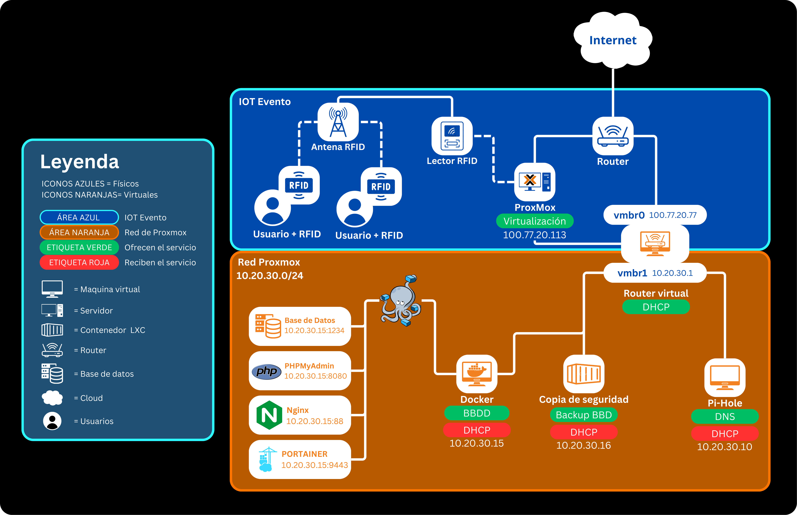
</details>

<details>
  <summary>Tabla de arquitectura de red final 🔽</summary>
  
  | Máquinas         | IP                                         | IP Gateway                          | Red                           |
  |------------------|--------------------------------------------|-------------------------------------|-------------------------------|
  | Proxmox          | 100.77.20.113                              | 100.77.20.1                         | 100.77.20.0/24                |
  | Router           | 100.77.20.77 (externa)<br>10.20.30.1 (interna) | 100.77.20.1 (externa)<br>10.20.30.1 (interna) | vmbr0 (100.77.20.0/24)<br>vmbr1 (10.20.30.0/24) |
  | Pihole           | 10.20.30.10                                | 10.20.30.1                          | vmbr1 (10.20.30.0/24)         |
  | Docker           | 10.20.30.15                                | 10.20.30.1                          | vmbr1 (10.20.30.0/24)         |
  | Docker > Portainer | 10.20.30.15:9443                         | 10.20.30.1                          | vmbr1 (10.20.30.0/24)         |
  | Docker > MySQL   | 10.20.30.15:1234                           | 10.20.30.1                          | vmbr1 (10.20.30.0/24)         |
  | Docker > PHPMyAdmin | 10.20.30.15:8080                        | 10.20.30.1                          | vmbr1 (10.20.30.0/24)         |
  | Docker > Nginx   | 10.20.30.15:88                             | 10.20.30.1                          | vmbr1 (10.20.30.0/24)         |
  | Contenedor BKP   | 10.20.30.16                                | 10.20.30.1                          | vmbr1 (10.20.30.0/24)         |


</details>

> [!IMPORTANT]
> Las funciones del cliente y Nginx se verán modificadas por la futura integración de Cloudflare en el proyecto. Más adelante veremos como afecta.

## 🛠️  Configuración de ROUTER
<details>
  <summary>Explicación 🔽</summary>
  Primero configuramos la red del router. Para ello cambiaremos el netplan ajustando las IP según la red, virtual o aula. Con ens18 identificaremos la red del aula y con ens19 la red virtual.
  Además, hemos implementado el servicio de DHCP en el router para que todos los dispositivos que estén dentro de la red virtual puedan obtener una IP sin necesidad de asignarla manualmente.
  
  ### Configuración de DHCP
  Para configurar el servicio DHCP, primero lo instalaremos en el router con el comando correspondiente. Luego crearemos una copia de seguridad del archivo de configuración para conservar la configuración original. Procederemos a editar el archivo de configuración y, en nuestro caso, hemos asignado el rango de IPs de *10.20.30.20* a *10.20.30.50*.
  
  También configuraremos distintas IPs para que siempre se asignen a las máquinas con los servicios de nuestra red de Proxmox, haciendo uso de su MAC. Gracias a esto conseguimos que siempre que se inicien las máquinas, tengan la misma dirección IP. Además, modificaremos el archivo ```isc-dhcp-server``` para indicar al router que funcione como servidor DHCP en la interfaz ens19.

```
# comandos usados

sudo apt install isc-dhcp-server                        # instalación del servicio DHCP
sudo cp /etc/dhcp/dhcpd.conf /etc/dhcp/dhcpd.conf.BKP   # creación de la copia de archivo
sudo nano /etc/dhcp/dhcpd.conf                          # modificación del archivo de configuración
sudo nano /etc/default/isc-dhcp-server                  # modificación del archivo de asiganción de interfaz
```

  ### Configuración de IPTables ⚠️
</details>

> 📎 [**Ver _anexo 2_ para configuración del Router**](#anexo-2-configuración-del-router)
>
> 🚩 [Ver informe de errores](#errores-con-el-router-)

## 󠁧󠁢󠁷🐋 Docker
<details>
  <summary>Explicación 🔽</summary>
  
  En nuestro proyecto, utilizaremos Docker para optimizar recursos y simplificar la gestión de nuestras aplicaciones.
  Docker nos permitirá desplegar contenedores ligeros, asegurando que cada servicio se ejecute de manera aislada y eficiente. Esto facilitará el desarrollo, la escalabilidad y el mantenimiento del sistema, ya que cada componente (base de datos, servidor web, herramientas de gestión, etc.) estará empaquetado en su propio contenedor con todas sus dependencias.
</details>

<details>
  <summary>🛠️  Configuración Docker 🔽</summary>

Para desplegar nuestros contenedores, primero creamos una máquina virtual en Proxmox, a la cual le asignamos la IP fija `10.20.30.15` dentro de nuestra red interna.

Una vez creada la VM, procedimos a instalar Docker. Como solo usamos un usuario llamado "docker", añadiremos dicho usuario al grupo de Docker y le damos todos los permisos para que pueda crear y administrar los contenedores. 

Para facilitar la administración visual de los contenedores, instalamos Portainer como un contenedor en Docker.

Para gestionar los contenedores, accedemos a Portainer desde una máquina virtual con Debian Desktop, ingresando en el navegador la Ip del equipo seguido del puerto que configuramos para portainer. `10.20.30.15:9443`
Aquí podemos visualizar y administrar nuestros contenedores de forma intuitiva, facilitando la gestión de servicios como la base de datos, Nginx y otros.

```bash
# comandos usados

###
instalación docker

sudo apt update && sudo apt upgrade -y # actualizar paquetes
sudo apt install -y apt-transport-https ca-certificates curl software-properties-common # instalar dependencias necesarias
curl -fsSL https://download.docker.com/linux/ubuntu/gpg | sudo gpg --dearmor -o /usr/share/keyrings/docker-archive-keyring.gpg # agregar la clave GPG de Docker
echo "deb [arch=$(dpkg --print-architecture) signed-by=/usr/share/keyrings/docker-archive-keyring.gpg] https://download.docker.com/linux/ubuntu $(lsb_release -cs) stable" | sudo tee /etc/apt/sources.list.d/docker.list > /dev/null # agregar el repositorio oficial de Docker
sudo apt update
sudo apt install -y docker-ce docker-ce-cli containerd.io # instalar docker
docker --version # verificar si docker está correctamente instalado

###

sudo usermod -aG docker $USER  # Agregar usuario al grupo Docker (requiere reiniciar sesión)

docker run -d -p 8000:8000 -p 9443:9443 --name portainer --restart=always -v /var/run/docker.sock:/var/run/docker.sock -v portainer_data:/data portainer/portainer-ce:latest  # creación de contenedor portainer 
```
</details>

<details>
  <summary>🛠️  Configuración Docker-Compose 🔽</summary>

  Para agilizar el despliegue de los contenedores que contendrán nuestra página web y base de datos, utilizamos Docker-Compose. Con esta herramienta, podemos definir y gestionar múltiples servicios en un solo archivo de configuración `(docker-compose.yml)`, lo que facilita la implementación y administración del entorno.

  [📑 Archivo de configuración docker-compose](assets/docker-compose.yml)

  📑 **Servicios incluidos**
  | Servicio     | Función                                        |
  |--------------|------------------------------------------------|
  | **PHP-FPM**  | Procesamiento de archivos PHP                  |
  | **MySQL**    | Base de datos para almacenamiento de información |
  | **phpMyAdmin** | Interfaz web para gestionar MySQL            |
  | **Nginx**    | Servidor web que maneja las peticiones HTTP    |

  Con esta configuración, conseguimos un entorno completo con PHP, MySQL, phpMyAdmin y Nginx, todos conectados en una red interna de Docker (app-network), lo que facilita la gestión y escalabilidad de nuestra aplicación.

  ```bash
# comandos usados

sudo apt install -y docker-compose  # instalar docker-compose
docker-compose up -d  # crear los contenedores en segundo plano
docker ps  # verificar que los contenedores están corriendo 
  ```
  
</details>

<details>
  <summary>🛠️  Configuración BackUps 🔽</summary>

  Para garantizar la seguridad de los datos recopilados en los eventos, hemos implementado un sistema de copias de seguridad adaptado a la magnitud de cada feria.
  
  Se ha creado un contenedor LXC con IP fija `10.20.30.16`, destinado a almacenar los respaldos de la base de datos. Para ello, hemos desarrollado un script que extrae la información almacenada y la envía comprimida al contenedor mediante `scp`, utilizando autenticación por clave RSA para evitar la necesidad de introducir contraseñas manualmente.
 
  Este script también actualiza un archivo de logs con el registro de cada backup realizado, y gestiona el almacenamiento eliminando automáticamente los archivos más antiguos, limitando el número máximo de copias a 4, para optimizar el espacio disponible.
 
  La ejecución automática del respaldo se ha programado en el `crontab` del usuario `root`, asegurando que solo un usuario autorizado pueda ejecutar y modificar el proceso.
  
  ☕ [**Código Backup implementado en el proyecto**](assets/scripts/backup_mysql.sh)
  
</details>


> 📎 [**Ver _anexo 3_ para configuración de Docker**](#anexo-3-configuración-de-docker)
>
> 🚩 [Ver informe de errores](#errores-con-docker-)

## 🗃️ Base de datos
<details>
  <summary>Explicación 🔽</summary>

  El diseño de la base de datos se ha estructurado siguiendo principios de normalización y simplicidad, buscando representar de forma eficiente las necesidades del proyecto.
  
  Se han definido cuatro entidades principales:
  - Planes: Permite gestionar distintos niveles de acceso y funcionalidad para las empresas clientes, facilitando la escalabilidad y personalización de servicios.
  - Empresas: Representa a cada cliente del sistema, vinculando su suscripción a un plan determinado y almacenando credenciales de acceso de manera segura.
  - Antenas: Registra los dispositivos desplegados por cada empresa en los eventos o ferias, identificando su ubicación para rastrear el flujo de personas.
  - Señales RFID: Almacena las lecturas de tarjetas RFID detectadas por las antenas, registrando tanto la hora de entrada como de salida, permitiendo así calcular el tiempo total de permanencia.
  
  Las relaciones entre las tablas siguen un modelo lógico de uno a muchos (1:N), lo que refleja de manera fiel la operativa real del sistema:
  - Un plan puede ser contratado por múltiples empresas.
  - Una empresa puede tener instaladas varias antenas.
  - Cada antena puede registrar múltiples señales RFID durante un evento.

  Además, se han implementado claves foráneas para garantizar la integridad referencial, y se ha creado un índice específico en el campo rfid_tag para optimizar las consultas relacionadas con la identificación de visitantes.
  
  Esta estructura modular y bien definida permitirá futuras ampliaciones del sistema, como la incorporación de estadísticas avanzadas, análisis de tráfico en tiempo real, o gestión de múltiples eventos simultáneos.
</details>

<details>
  <summary>Diagrama base de datos 🔽</summary>

  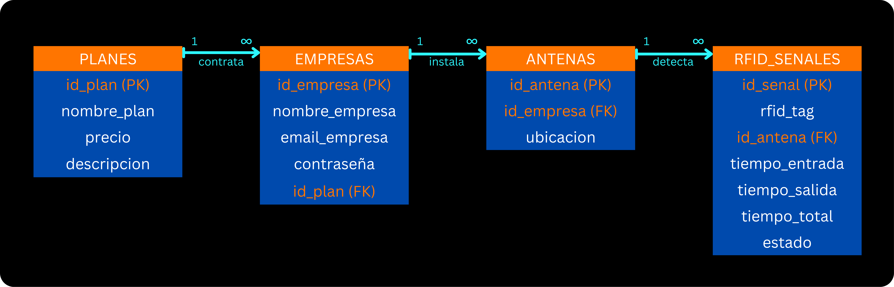

</details>

> ☕[Código Base de Datos](assets/scripts/rfid.sql)

## 🔌 Arudino
<details>
  <summary>Explicación 🔽</summary>
  
Hemos implementado un sistema con dos placas, una Arduino Mega y una ESP32, equipadas con lectores RFID para simular antenas receptoras. Estas antenas capturan los datos de las tarjetas RFID asignadas a los usuarios. Los datos recopilados se envían a través de un script en Python, que se encarga de procesarlos y estructurarlos adecuadamente.

Posteriormente, la información procesada se almacena en una base de datos MySQL, desplegada en un contenedor Docker para garantizar escalabilidad y portabilidad. Este sistema integra hardware y software de manera eficiente, proporcionando una solución práctica y segura para la gestión de datos RFID.
</details>

<details>
  <summary>Mapa de calor 🔽</summary>
  Estos scripts están diseñados para procesar y visualizar los datos recopilados por las antenas RFID, previamente almacenados en una base de datos MySQL. A través de consultas SQL y herramientas de visualización como Matplotlib y Pandas, se generan representaciones     gráficas que facilitan la interpretación de la afluencia de personas en las áreas monitoreadas por las antenas.

- El primer script integra la base de datos MySQL para obtener datos en tiempo real, transformándolos en una matriz que representa la distribución de señales y generando un mapa de calor dinámico.
- El segundo script crea un mapa de calor bidimensional que simula una cuadrícula de antenas, asignando colores en función de la cantidad de señales detectadas.
- El tercer script utiliza un gráfico de barras para mostrar la cantidad de señales captadas por cada antena, proporcionando una vista más compacta y comparativa.

En conjunto, estos scripts permiten analizar de forma clara y visual la actividad registrada por el sistema RFID, ofreciendo una solución práctica y escalable para gestionar y comprender los datos recolectados.

> ☕[Código Python Mapa de calor](assets/scripts/mapa_calor_rfid.py)
> 
> ☕[Código Python Cuadricula](assets/scripts/cuadricula_mapa_calor_rfid.py)
> 
> ☕[Código Python Gráficos](assets/scripts/graficos_mapa_calor_rfid.py)

</details>

<details>
  <summary>Explicación Implementación Ngrok 🔽</summary>
  
  En el contexto del proyecto, no sería estrictamente necesaria la implementación de Ngrok para la funcionalidad esencial, ya que está pensado para desplegarse en ferias y eventos a través de una red local, donde los dispositivos se comunican entre sí sin necesidad de acceso externo.
  
  Sin embargo, para la presentación del proyecto y la posibilidad de usar los lectores RFID desde ubicaciones remotas (en distintas redes), se implementó un túnel utilizando Ngrok.
Para ello, fue necesario modificar el código inicialmente diseñado para uso local, ajustando el puerto de conexión y dirigiendo la comunicación hacia localhost en vez de una dirección IP concreta.

### Configuración del tunel
Ngrok se configuró para redirigir toda la información enviada desde un equipo local hacia un puerto específico (por ejemplo, 1234), y enviarla a través del túnel hasta el servidor Proxmox. Una vez en Proxmox, se redirige la conexión hacia la IP y puerto del router virtual, el cual ya está configurado con reglas de port forwarding para que toda la información recibida en el puerto 1234 se envíe a la base de datos MySQL del contenedor.

```
# comando usado para hacer la conexión
ssh -N -L <puertoLocalHost>:<IPRouterVirtual>:<puertoRouterVirtual> root@x.tcp.eu.ngrok.io -p xxxx
```

### Antenas y ejecución distribuida
Tras realizar diversas pruebas, se concluyó que es necesario ejecutar cada lector RFID (Arduino) desde un equipo distinto, debido a conflictos de puerto y concurrencia. Además, cada script Python debe especificar el ID de la antena que está utilizando. Esta identificación permite que la base de datos relacione correctamente cada antena con la empresa y ubicación correspondiente, permitiendo un registro organizado y fiable de las señales RFID detectadas.

</details>

> 🗞️[Guía Arduino Mega](assets/files/ArduinoMega.pdf)
> 
> 🗞️[Guía Arduino Wrover](assets/files/ArduinoWrover.pdf)
> 
> ☕[Código Python en red local](assets/scripts/python_local.py) y ☕[Código Python en red externa](assets/scripts/python_externa.py)
>
> 🚩 [Ver informe de errores](#errores-con-arduino-)

<hr>

# ➕ EXTRAS
En este apartado añadimos aquellos trabajos y documentos realizados en clase pero, por la propia naturaleza de nuestro proyecto, no podemos implementar.

## 󠁧󠁢󠁷🐋 Docker
<details>
  <summary>Explicación 🔽</summary>

Docker ofrece un método unificado para ejecutar su código. Actúa como un sistema operativo diseñado específicamente para contenedores. Así como una máquina virtual abstrae el hardware del servidor, los contenedores en Docker abstraen y virtualizan el sistema operativo del servidor, simplificando su gestión.

> 🗞️ [**Documento Preguntas frecuentes de Docker**](assets/files/RfidTrafficAnalyst_Preguntas%20frecuentes%20Docker.pdf)
> 
> 🛠️ [**Ver la implementación de Docker en el proyecto.**](#-docker)

</details>

## 🔒 pfSense

<details>
  <summary>Explicación 🔽</summary>

pfSense es una distribución de firewall y enrutador basada en FreeBSD, diseñada para ofrecer seguridad y control de red de nivel empresarial. Es una solución de código abierto que permite gestionar el tráfico de la red, configurar VPNs, aplicar reglas de firewall avanzadas y monitorear el tráfico, todo desde una interfaz web intuitiva. Es ampliamente utilizado en entornos corporativos, educativos y domésticos por su flexibilidad, rendimiento y comunidad activa.

> 🗞️ [**Documento Guía de instalación pfSense**](assets/files/RfidTrafficAnalyst_pfSense_Guia%20de%20Usuario.pdf)

</details>

## ➿ BackUp

<details>
  <summary>Explicación 🔽</summary>
  
Backup es el proceso de crear copias de seguridad de datos para protegerlos contra pérdidas, fallos de hardware, ataques cibernéticos o errores humanos. Existen diferentes tipos de copias de seguridad, como completas, incrementales y diferenciales, y pueden almacenarse en dispositivos locales, servidores remotos o en la nube. Contar con una estrategia de backup adecuada es fundamental para garantizar la continuidad y seguridad de la información en cualquier entorno, ya sea personal o empresarial.

> 🗞️ [**Documento Guía de usaurio Backups**](assets/files/RfidTrafficAnalyst_Backup-script_Guia%20de%20usuario.pdf) || 🗞️ [**Documento Explicación scripts Backup**](assets/files/RfidTrafficAnalyst_Backup-script.pdf)
>
> ☕ [**Código Backup Base de Datos**](assets/scripts/backup_db.sh) || ☕ [**Código Backup de restauración**](assets/scripts/restore.sh) || ☕ [**Código Backup Full o incremental**](assets/scripts/backup_full_incremental.sh)

</details>

## 📧 Ejabberd + Pidgin

<details>
  <summary>Explicación 🔽</summary>

Ejabberd es un servidor de mensajería instantánea basado en el protocolo XMPP (Jabber). Es de código abierto, altamente escalable y utilizado para crear servicios de chat en tiempo real, como mensajería privada o grupal en aplicaciones y empresas.

Pidgin es un cliente de mensajería instantánea multiprotocolo que permite conectarse a diferentes servicios de chat (como XMPP, IRC o Discord) desde una sola aplicación. Es de código abierto y compatible con complementos para ampliar sus funciones.

> 🗞️ [**Documento Preguntas Frecuentes Ejabberd**](assets/files/RfidTrafficAnalyst_ChatTiempoReal_FAQs.pdf)
> 
> 🗞️ [**Página Guía de usuario Ejabberd + Pidgin**](https://gsoteras.gitbook.io/gsoteras/servidores/chat-tiempo-real)

</details>

## 🛜 Ngrok

<details>
  <summary>Explicación 🔽</summary>

  Para facilitar el acceso remoto a la interfaz web de Proxmox desde cualquier ubicación, se ha integrado Ngrok en el sistema. Esta herramienta permite exponer servicios locales a través de túneles seguros, sin necesidad de configurar el router o abrir puertos manualmente.

  <details>
    <summary>🔧 Instalación y configuración de Ngrok 🔽</summary>
  
  ### Registro y autenticación
  - Crear una cuenta en ngrok.com y obtener el authtoken desde el panel de usuario.
  - Instalar Ngrok en la máquina Proxmox siguiendo las instrucciones oficiales para Linux.
  - Autenticar Ngrok.

    ```bash
    # comandos usados
    wget https://bin.equinox.io/c/bNyj1mQVY4c/ngrok-v3-stable-linux-amd64.tgz
    tar -xvzf ngrok-v3-stable-linux-amd64.tgz -C /usr/local/bin/
    ngrok config add-authtoken <tu_authtoken>
    ngrok tcp 22
    ```
    
  ### Integración con systemd
  - Crear un servicio para que Ngrok se inicie automáticamente al arrancar el sistema.
    
    ```bash
    nano /etc/systemd/system/ngrok.service

    # ----------------
    [Unit]
    Description=Ngrok tunnel
    After=network.target
    [Service]
    Restart=on-failure
    User=root
    ExecStart=/usr/local/bin/ngrok tcp 22
    [Install]
    WantedBy=multi-user.target
    # ----------------

    systemctl daemon-reload
    systemctl start ngrok.service
    systemctl enable ngrok.service
    ```
  
  ### Acceso remoto a Proxmox
  Una vez iniciado el servicio, Ngrok proporcionará una dirección TCP pública. Para acceder a la interfaz web de Proxmox de forma segura.
  Esta dirección la podemos encontrar en el ``Panel de control de Ngrok > Universal Gateway > Endpoints``
  
  Además, podemos especificar un puerto para mostrar en el navegador la interfaz de Proxmox como si estuviera en la red local.
  
  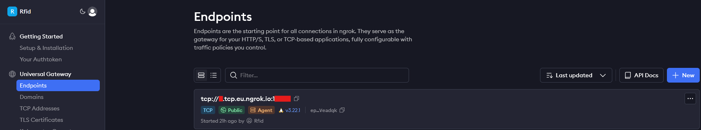
  
  ```bash
  ssh -L 1234:localhost:8006 root@<subdominio>.tcp.ngrok.io -p <puerto>
  # en el navegador
  https://localhost:1234
  ```

  > ⚠️ Importante: La dirección y el puerto asignados por Ngrok pueden cambiar en cada reinicio. Para obtener una dirección fija, es necesario configurar una dirección TCP reservada desde el panel de Ngrok (requiere plan de pago).

  </details>
</details>


<hr>

# 📎 Anexos
En este apartado se encuentran los detalles más específicos de configuración del proyecto.

## Anexo 1 (entorno ProxMox)
<details>
  <summary>Ver anexo 🔽</summary>
  
  ### Adaptador puente
  Asignamos al router que use un adaptador puente para que pueda comunicar el interior de la red, con el exterior. Esto lo hacemos configurando el vmbr0 con la red externa y añadiendo un nuevo adaptador vmbr1 con la IP de la red virtual.
  
  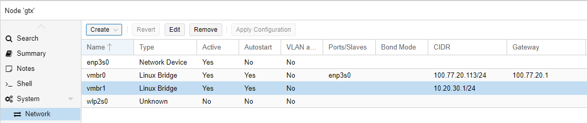
  ### Interfaz de red para el router
  Aquí podemos ver que una vez realizadas las acciones de la imagen anterior, el router ya nos reconocerá como hardware, las dos interfaces de red.
  
  
  ### Panel de configuración para activar QEMU
  Activamos y configuramos la función QEMU, para que nos sea mucho más fácil trabajar con las IP's existentes sin necesidad de acceder a la máquina.
  
  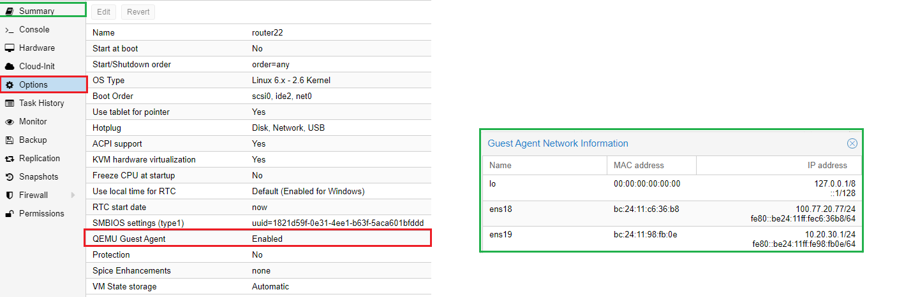
  ### Configuración IPtables
</details>

## Anexo 2 (configuración del Router)
<details>
  <summary>Ver anexo 🔽</summary>
  
  ### Netplan del router
  Esta configuración es extremadamente importante para que el router garantice la total comunicación entre la red interna y la externa, en la primera parte vemos la configuración para la red 100.77.20.0/24 (externa) y en la segunda parte 10.20.30.0/24 (virtual).
  
  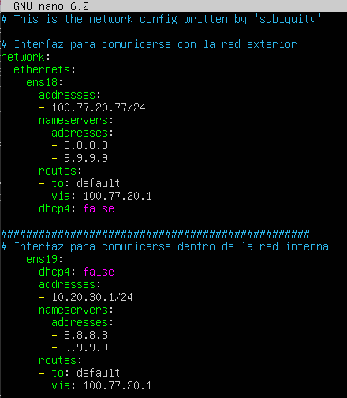
  ### Archivo sysctl
  Configuramos el router para que pueda hacer de gateway y pueda enrutar el tráfico de red para garantizar la comunicación en las redes presentes en el archivo "netplan".
  
  
  ### Archivo de configuración DHCP en el router
  Añadimos y modificamos las lineas necesarias en para que el router haga de DHCP en la red 10.20.30.0/24. Para garantizar la seguridad y la redundancia de IP's dentro de esta red, además configuramos una línea para que empiece a asignar IP's a partir de la 10.20.30.20, para poder añadir contenedores, equipos y servidores sin que afecten a la asignacion de IP's. También especificamos que el servidor DNS se encuentra en la dirección IP 10.20.30.10.
  
  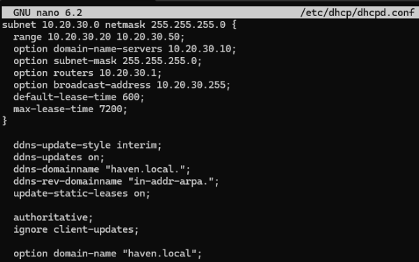

  También añadiremos unas líneas para que siempre se asigne la misma IP a unos equipos determinados. Esto lo logramos asociando una IP a una MAC.

  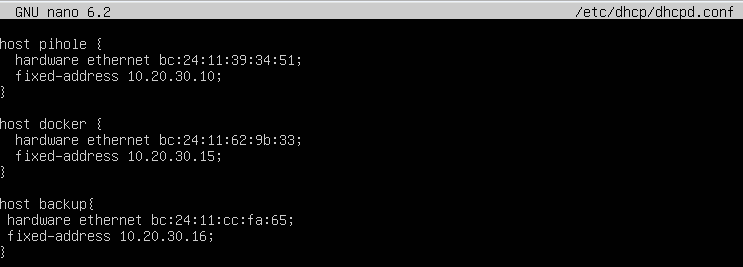
  ### Archivo de configuración ISC-DHCP en el router
  Con estas líneas le pedimos al router que asigne direcciones IP solo en la interfaz ens19 para IPv4, usando las rutas de configuración y PID predeterminadas. No está configurado para IPv6.

  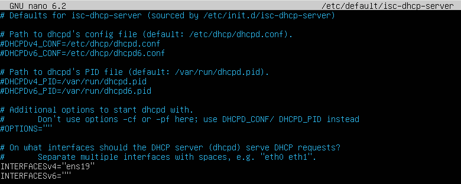
</details>

## Anexo 3 (configuración de Docker)
<details>
  <summary>Ver anexo 🔽</summary>
  
  ### Organización de directorios en Docker
  Para mantener nuestro proyecto ordenado y estructurado, hemos organizado los archivos y directorios de la siguiente manera. Gracias a esta estructura, docker-compose pude ejecutarse de forma correcta.

  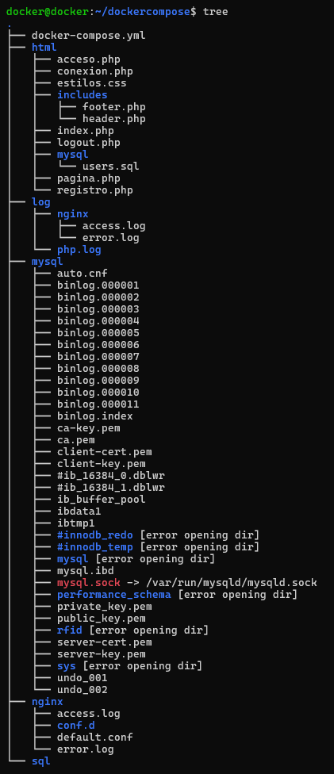

  ### Archivo de configuración Nginx
  Para que nuestro servidor Nginx sirva correctamente nuestra aplicación, hemos modificado el archivo de configuración por defecto. En la imagen a continuación, se muestra el contenido del archivo `default.conf`, donde hemos ajustado la configuración para que apunte a nuestro archivo index.php y procese correctamente las peticiones a través de PHP-FPM.

  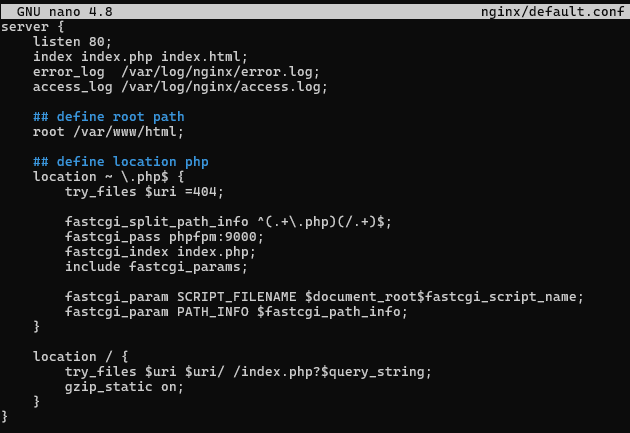

  ### Crontab de root para backup
  Se ha programado la ejecución automática del script de backup en el crontab del usuario root, configurando su ejecución cada 5 minutos para garantizar una copia continua de los datos sin intervención manual.

  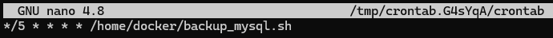

  ### Archivo de logs BackUp
  Cada vez que el script se ejecuta, registra su actividad en un archivo de logs. Este registro permite monitorizar en todo momento el estado de los backups y detectar posibles errores de forma rápida.
  
  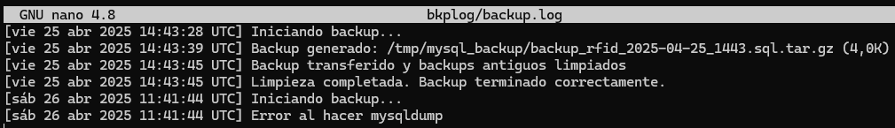

  ### Archivos comprimidos BackUp
  Tras cada ejecución del script, los datos respaldados se almacenan comprimidos en el contenedor LXC. El sistema mantiene un máximo de 4 copias, eliminando automáticamente las más antiguas para optimizar el espacio de almacenamiento. Este límite puede ser modificado fácilmente si se requiere.
  
  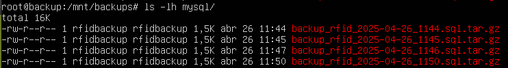
  
</details>

<hr>

# 🚩 Informe de errores
En este apartado se encuantran todas las dificultades y errores que han ido surgiendo a medida que progresava el proyecto.

## Errores con el router 🚩
<details>
  <summary>Ver informe 🔽</summary>
A la hora de configurar el router, tuvimos sobre todo problemas con errores tipográficos. Esto sucedió tanto en la configuración de Netplan como en la configuración de las reglas de IPtables.
Además, tuvimos varios problemas al intentar guardar las reglas de IPtables, ya que, al reiniciar el router, algunas reglas desaparecían. Esto ocurría porque las reglas no se guardaban de modo persistente.
</details>
  
## Errores Pi-hole DNS Server 🚩
<details>
  <summary>Ver informe 🔽</summary>
  
  En la version de **Proxmox 8.2 y 8.3**, el archivo ```/etc/resolv.conf``` se sobrescribe automáticamente dos veces al reiniciar la máquina debido a:

  **1a vez:** *Servicio systemd-resolved:* Modifica el archivo de configuración DNS, de manera automática.

  **2a vez:** *Proxmox:* Sobrescribe el archivo durante el inicio del contenedor.

  Esto provoca que:
    **No** podemos modificar manualmente el archivo /etc/resolv.conf.
    **No** se pueden ejecutar scripts que cambien el archivo en el arranque del contenedor.
    **No** se puede filtrar el tráfico DNS adecuadamente.
    El DNS **siempre** se establece en 8.8.8.8, ignorando configuraciones internas.
    Entre muchas otras conseqüencias...
    
  ✅**SOLUCIÓN**
  **Paso 1:** *Detener el servicio systemd-resolved*
  Detenemos el servicio para evitar que sobrescriba el archivo DNS.
  
```
systemctl disable systemd-resolved
systemctl stop systemd-resolved
```

  **Paso 2:** *Configurar DNS en cada arranque. utilizando ```crontab```*

  Modificar el archivo crontab, ya que este archivo ejecuta instrucciones de manera persistente.

```
#Localizacion del archivo /tmp/crontab.RwAtVi/crontab
crontab -e
@reboot echo "nameserver 127.0.0.1" > /etc/resolv.conf #Añadir esta linea, dentro del archivo
```

  Esta línea asegura que el archivo ```/etc/resolv.conf``` apunte al servidor DNS local (127.0.0.1) en cada reinicio, evitando sobrescrituras por parte de Proxmox o systemd-resolved.
  Con estos pasos, se asegura que el contenedor de Pi-hole utilice su propio servidor DNS de manera persistente, permitiendo un filtrado efectivo del tráfico DNS y manteniendo la configuración deseada entre reinicios.
</details>

## Errores con Docker 🚩
<details>
  <summary>Ver informe 🔽</summary>
  
  El archivo ```rfid.sql``` que es el archivo donde se programa la base de datos daba errores con el docker-compose.yml.
  
  Probamos cambiando permisos, la ruta, el archivo .sql y él .yml... Pero no encontrábamos la solución.
  
  Al final decidimos programar la base de datos manualmente y empezó a funcionarnos a la perfección.
  
</details>

## Errores con Arduino 🚩
<details>
  <summary>Ver informe 🔽</summary>
  
  Durante el desarrollo de este apartado del proyecto, surgieron varios desafíos y errores que influyeron en el proceso de implementación.
  A continuación, se detallan los más relevantes:
  
  **Error 1:** *Errores en la Conexión del Cableado*
   La configuración inicial del hardware presentó problemas debido a un desconocimiento sobre el correcto cableado de las placas Arduino y los módulos RFID.
   Esto ocasionó fallos en la comunicación entre los componentes, lo que requirió tiempo adicional para estudiar la documentación y las especificaciones técnicas de los módulos.

   **Error 2:** *Uso de Librerías Externas*
   Para el funcionamiento del lector RFID, fue necesario utilizar librerías externas específicas. 
   Identificar en plataformas como GitHub la librería adecuada que se adaptara a las necesidades del proyecto fue un proceso complicado, ya que muchas de las opciones disponibles no tenían documentación clara o estaban desactualizadas.

   **Error 3:** *Conflicto entre el Serial de Arduino y Python*
   Uno de los errores recurrentes fue intentar leer simultáneamente los datos del puerto serie en Arduino y Python. Esto generaba conflictos, ya que el puerto serie no puede ser usado por ambas plataformas al mismo tiempo.
   La solución implicó gestionar precisamente cuándo, cómo y qué accedía al puerto serie, garantizando que Python pudiera leer los datos sin interferencias con el Arduino IDE.

   **Error 4:** *Añadir antenas*
   En el archivo ```.sql``` que monta la Base de Datos, se genera la empresa RFID y la antena, así ambos valores están relacionados entre sí.
   Esto causa que al añadir nuevas antenas físicas, se tengan que añadir manualmente a la base de datos.
  
</details>

